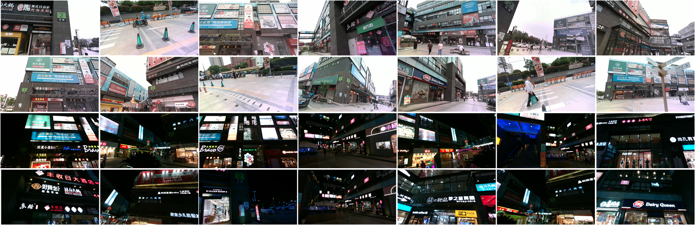
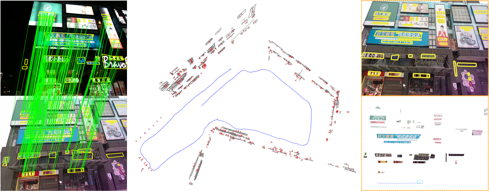

# TextSLAM (coming soon)

:star: TextSLAM is a novel visual Simultaneous Localization and Mapping system (SLAM) tightly coupled with semantic text objects.

:bulb: Humans can read texts and navigate complex environments using scene texts, such as road markings and room names. why not robots?

:star: TextSLAM explores scene texts as the basic feature both geometrically and semantically. It achieves superior performance even under challenging environments, such as image blurring, large viewpoint changes, and significant illumination variations (day and night).

In the project we provide:
- **C++ implementation of our TextSLAM system**  
- **A large text-orientated dataset covering indoor and outdoor scenes with ground truth.**  


<div align='center'><em>Overview of TextSLAM dataset</em></div>
&emsp;
 
<em><div align='center'>Overview of TextSLAM</div></em>
&emsp;

The papers of the project:  
- [TextSLAM: Visual SLAM with Semantic Planar Text Features](https://arxiv.org/abs/2305.10029)  
Boying Li, Danping Zou, Yuan Huang, Xinghan Niu, Ling Pei, Wenxian Yu  
- [TextSLAM: Visual SLAM with Planar Text Features](https://arxiv.org/abs/1912.05002)  
Boying Li, Danping Zou, Daniele Sartori, Ling Pei, Wenxian Yu    

Please consider citing the following papers in your publications if the project helps your research.
```
@article{li2023textslam,
  title={TextSLAM: Visual SLAM with Semantic Planar Text Features},
  author={Li, Boying and Zou, Danping and Huang, Yuan and Niu, Xinghan and Pei, Ling and Yu, Wenxian},
  booktitle={arXiv preprint},
  year={2023}
}

@inproceedings{li2020textslam,
  title={TextSLAM: Visual SLAM with Planar Text Features},
  author={Li, Boying and Zou, Danping and Sartori, Daniele and Pei, Ling and Yu, Wenxian},
  booktitle={IEEE International Conference on Robotics and Automation (ICRA)},
  year={2020}
}
```

